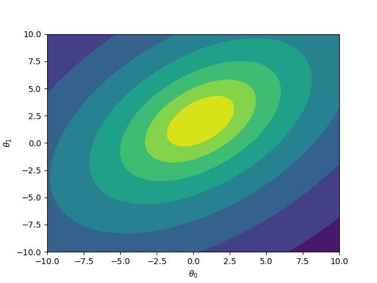
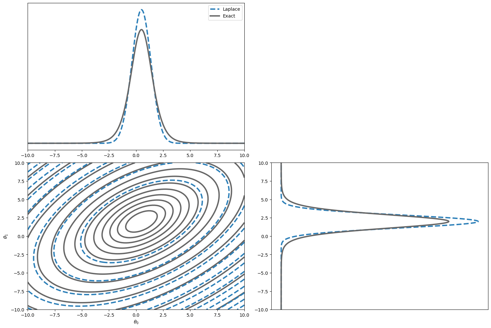
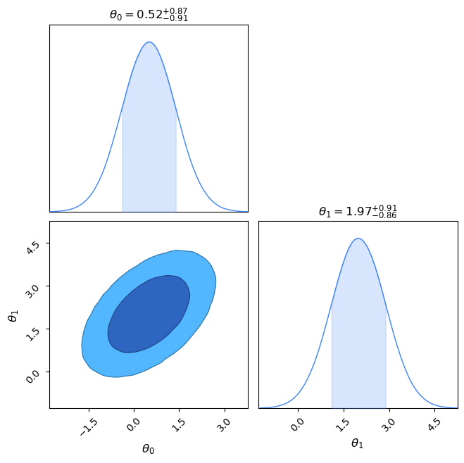
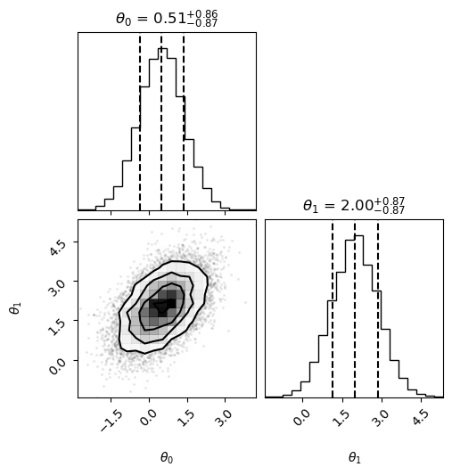

## Introduction

This is an adaptation of a [blog by my colleague Angus Williams](https://github.com/anguswilliams91/anguswilliams91.github.io/blob/backup/_posts/2019-11-23-jax.md), which is no longer up. In it, we describe how Jax can be used to implement an important method in Bayesian statistics: *Laplace's approximation*.

### The Laplace approximation

Imagine we have some probability model with some parameters \(\theta\), and we've constrained the model using some data \(D\).
In Bayesian inference, our goal is always to calculate integrals like this:

$$\mathbb{E}\left[h(\theta)\right] = \int \mathrm{d}\theta \, h(\theta) \, p(\theta | D)$$  


we are interested in the expectation of some function \(h(\theta)\) with respect to the *posterior distribution* \(p(\theta | D)\). 
For interesting models, the posterior is complex, and so we have no hope of calculating these integrals analytically.
Because of this, Bayesians have devised many methods for approximating them. 
If you've got time, the best thing to do is use [Markov Chain Monte Carlo](https://en.wikipedia.org/wiki/Markov_chain_Monte_Carlo). 
But, if your dataset is quite large relative to your time and computational budget, you may need to try something else. A typical choice is [Variational Inference](https://en.wikipedia.org/wiki/Variational_Bayesian_methods). 

Another, possibly less talked-about, approach is called Laplace's approximation.
It works really well when you have quite a lot of data because of the *Bayesian central limit theorem*.
In this approach, we approximate the posterior distribution by a Normal distribution.
This is a common approximation (it's often used in Variational Inference too), but Laplace's method has a specific way of finding the Normal distribution that best matches the posterior.

Suppose we know the location \(\theta^*\) of the maximum point of the posterior[^1].
Now let's Taylor expand the log posterior around this point.
To reduce clutter, I'll use the notation \(\log p(\theta | D) \equiv f(\theta)\).
For simplicity, let's consider the case when \(\theta\) is scalar:

$$
f(\theta) 
\approx 
f(\theta^*) 
+ \frac{\partial f}{\partial \theta}\bigg|_{\theta^*}\,(\theta - \theta^*)
+ \dfrac{1}{2}\frac{\partial^2 f}{\partial \theta^2}\bigg|_{\theta^*}\,(\theta - \theta^*)^2
\\
= f(\theta^*) 
+ \dfrac{1}{2}\frac{\partial^2 f}{\partial \theta^2}\bigg|_{\theta^*}\,(\theta - \theta^*)^2
$$

The first derivative disappears because \(\theta^*\) is a maximum point, so the gradient there is zero. 
Let's compare this to the logarithm of a normal distribution with mean \(\mu\) and standard deviation \(\sigma\), which I'll call \(g(\theta)\):

$$
g(\theta) = -\frac{1}{2}\log (2\pi\sigma^2) - \dfrac{1}{2}\dfrac{1}{\sigma^2}(\theta - \mu)^2
$$

We can match up the terms in the expressions for \(g(\theta)\) and the Taylor expansion of \(f(\theta)\) (ignoring the constant additive terms) to see that

$$
\mu = \theta^* \\
\sigma^2 = \left(-\dfrac{\partial^2 f}{\partial \theta^2}\bigg|_{\theta^*}\right)^{-1}
$$

Consequently, we might try approximating the posterior distribution with a Normal distribution, and set the mean and variance to these values.
In multiple dimensions, the covariance matrix of the resulting multivariate normal is the inverse of the Hessian matrix of the negative log posterior at \(\theta^*\):

$$\Sigma_{ij} = \dfrac{\partial ^2 (-f)}{\partial \theta_i \partial \theta_j}^{-1}\bigg|_{\theta^*}$$

Already, we can see that Laplace's approximation requires us to be able to twice differentiate the posterior distribution in order to obtain \(\sigma\). In addition, we have to find the location \(\theta^* \) of the maximum of the posterior. We probably have to do this numerically, which means using some kind of optimisation routine. The most efficient of these optimisation routines require the gradient of the objective function. So, using Laplace's approximation means we want to evaluate the *first and second derivatives of the posterior*. Sounds like a job for `jax`!


## Example: a Student-t posterior distribution

Suppose our true posterior is a 2D Student-t:

$$
p(\theta | D) 
\propto 
\left(1+\frac{1}{\nu}(\theta - \mu)^T \Sigma^{-1}(\theta - \mu)\right)^{-(\nu + \mathrm{dim}(\theta))/2}
$$

This is a simple example, and we can actually sample from a Student-t rather easily.
Nevertheless, let's go ahead and use it to implement Laplace's method in `jax`.
Let's set the values of the constants in the Student-t:

$$
\mu = \begin{pmatrix}
0.5 \\
2
\end{pmatrix}
\\
\Sigma = \begin{pmatrix}
1 & 0.5 \\
0.5 & 1
\end{pmatrix}
\\
\nu = 7
$$

To implement this in `jax`, we first import all the relevant packages.

??? abstract "Import Dependencies" 
    ```python 
    import jax.numpy as np
    from jax import jit, grad, vmap, hessian

    import matplotlib.pyplot as plt

    from scipy.optimize import minimize
    from scipy.stats import multivariate_normal

    from chainconsumer import ChainConsumer, Chain
    ```

First, let's plot the log posterior:


```python
# choose some values for the Student-t
sigma = np.array([(1.0, 0.5), (0.5, 1.0)])
mu = np.array([0.5, 2.0])
nu = np.array([7])

sigma_inv = np.linalg.inv(sigma)

def log_posterior(theta):
    return np.log(
            1.0 + nu ** -1.0 * np.dot((theta - mu), np.dot(sigma_inv, (theta - mu).T).T)
        ) * (0.5  * -(nu + theta.shape[0]))
```

??? abstract "Plotting Code" 
    ```python 
    # plot the distribution
    x = np.linspace(-10, 10, 100)
    y = np.linspace(-10, 10, 100)

    X, Y = np.meshgrid(x, y)
    XY = np.stack((X, Y)).reshape(2, 10000).T

    Z = vmap(log_posterior, in_axes=0)(XY).reshape(100, 100)

    fig, ax = plt.subplots()
    ax.contourf(X, Y, Z)
    ax.set_xlabel(r"$\theta_0$")
    _ = ax.set_ylabel(r"$\theta_1$")
    ```




Now let's implement Laplace's method in `jax`:

```python
@jit
def negative_log_posterior(theta):
    # negative log posterior to minimise
    return (-np.log(
        1.0 + nu ** -1.0 * np.dot((theta - mu), np.dot(sigma_inv, (theta - mu).T).T)
    ) * (0.5  * -(nu + theta.shape[0])))[0]

@jit
def grad_negative_log_posterior(theta):
    # gradient of the negative log posterior
    return grad(negative_log_posterior)(theta)

@jit
def approx_covariance_matrix(theta):
    # evaluate the covariance matrix of the approximate normal
    return np.linalg.inv(hessian(negative_log_posterior)(theta))

# go!
theta_star = minimize(
    negative_log_posterior, 
    np.array([0.0, 0.0]), 
    jac=grad_negative_log_posterior, 
    method="BFGS"
).x

sigma_approx = approx_covariance_matrix(theta_star)
```

This is a *very* short piece of code! I had to define the negative log posterior (and JIT compiled it for speed), since we will minimise this to find \(\theta^*\). Then, I used `jax`'s `grad` function to differentiate this once, so that we can used a gradient-based optimiser. Next, I used `jax`'s `hessian` function to find the covariance matrix for our approximating normal. 
Finally, I used scipy's `minimize` function to find the optimal point \(\theta^*\). 

Note that this code is actually rather general! As long as the function `negative_log_posterior` can be implemented in a way that `jax` can differentiate (which it probably can), then the rest of the code stays exactly the same!
Let's have a look at how good our normal approximation is:

??? abstract "Plotting code" 
    ```python
    from scipy.stats import norm
    from scipy.stats import t

    fig = plt.figure(constrained_layout=True, figsize=(15, 10))
    spec = fig.add_gridspec(ncols=2, nrows=2)
    fig.subplots_adjust(hspace=0, wspace=0)

    ax3 = fig.add_subplot(spec[0, 0])
    ax2 = fig.add_subplot(spec[1, 1])
    ax1 = fig.add_subplot(spec[1, 0])

    contour = ax1.contour(
        X, Y, Z / Z.max(), colors="0.4", levels=15, linestyles="-", linewidths=3
    )

    # calculate the density of the approximating Normal distribution
    Z_0 = (
        multivariate_normal(mean=theta_star, cov=sigma_approx).logpdf(XY).reshape(100, 100)
    )

    ax1.contour(
        X, Y, Z_0 / Z_0.max(), colors="#2c7fb8", levels=15, linestyles="--", linewidths=3
    )

    ax1.set_xlabel(r"$\theta_0$")
    ax1.set_ylabel(r"$\theta_1$")


    ax2.plot(
        norm.pdf(theta_grid, theta_star[1], np.sqrt(sigma_approx[1, 1])),
        theta_grid,
        c="#2c7fb8",
        ls="--",
        lw=3,
    )
    ax2.plot(
        t.pdf(theta_grid, nu[1], mu[1], np.sqrt(sigma[1, 1])), theta_grid, c="0.4", lw=3
    )


    ax3.plot(
        theta_grid,
        norm.pdf(theta_grid, theta_star[0], np.sqrt(sigma_approx[0, 0])),
        c="#2c7fb8",
        ls="--",
        lw=3,
        label="Laplace",
    )
    ax3.plot(
        theta_grid,
        t.pdf(theta_grid, nu[0], mu[0], np.sqrt(sigma[0, 0])),
        c="0.4",
        lw=3,
        label="Exact",
    )
    ax3.legend()

    ax2.xaxis.set_visible(False)
    ax3.yaxis.set_visible(False)
    ```




At least by eye, the approximation seems reasonable. Of course, I have rather cheated here since a Student-t approaches a normal distribution as \(\nu \rightarrow \infty\). Nonetheless, it's still pleasing to see that the numerical implementation with `jax` and scipy works as expected.

### Using ChainConsumer or Corner

While above we used custom plotting code to make a corner plot overlaying the true and approximate distributions, if you're using the popular [ChainConsumer](https://samreay.github.io/ChainConsumer/) library, there are convenience functions for plotting Laplace/Fisher derived distributions:

```python
c = ChainConsumer()

c.add_chain(Chain.from_covariance(mean=theta_star,covariance=sigma_approx,columns=[r"$\theta_0$", r"$\theta_1$"],name="Laplace"))

c.plotter.plot();
```


If you're using [corner.py](https://corner.readthedocs.io/en/latest/) or [pairplots](https://sefffal.github.io/PairPlots.jl) to my knowledge, there aren't convenience functions like this - but you can just sample from the multivariate normal and pass it:

```python
import numpy as onp
import corner

samples = onp.random.multivariate_normal(theta_star, sigma_approx, 10000)

figure = corner.corner(
    samples,
    labels=[
        r"$\theta_0$",
        r"$\theta_1$",
    ],
    quantiles=[0.16, 0.5, 0.84],
    show_titles=True,
    title_kwargs={"fontsize": 12},
)
```




[^1]: I'm assuming there's only one maximum, but in reality there might be several if the posterior is multimodal. Multimodality is a pain, and Laplace's approximation won't do as well in this case (in fact most methods in Bayesian statistics share this weakness).